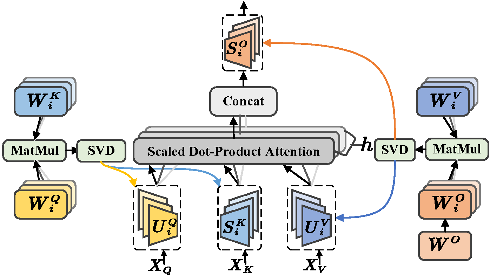
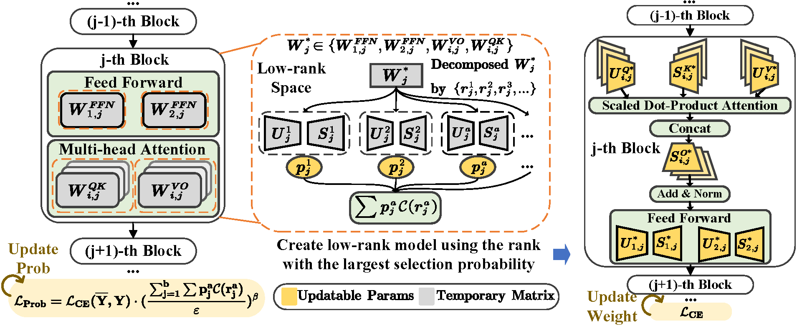
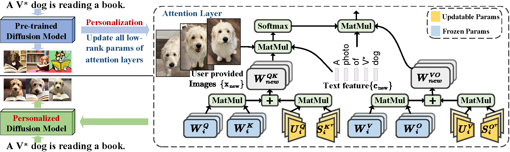

# COMCAT: Towards Efficient Compression and Customization of Attention-Based Vision Models [[arXiv]](https://arxiv.org/abs/2305.17235) 
```bash
@article{xiao2023comcat,
  title={COMCAT: Towards Efficient Compression and Customization of Attention-Based Vision Models},
  author={Xiao, Jinqi and Yin, Miao and Gong, Yu and Zang, Xiao and Ren, Jian and Yuan, Bo},
  journal={arXiv preprint arXiv:2305.17235},
  year={2023}
}
```

# What is ComCAT?
<!-- #### Head-level low-rankness of MHA layer. -->
<p align="center">
    
</p>
ComCAT explores an efficient method for compressing vision transformers to enrich the toolset for obtaining compact attention-based vision models. Based on the new insight on the multi-head attention layer, we develop a highly efficient ViT compression solution, which outperforms the state-of-the-art pruning methods, bringing highly efficient low-rank attention-based vision model compression solution.  

For compressing DeiTsmall and DeiT-base models on ImageNet, ComCAT can achieve 0.45% and 0.76% higher top-1 accuracy even with fewer parameters. ComCAT can also be applied to improve the customization efficiency of text-to-image diffusion models, with much faster training (up to 2.6× speedup) and lower extra storage cost (up to 1927.5× reduction) than the existing works.

# Vision Transformer Compression

#### Compressing vision transformer using low-rank MHA layers and automatic rank selection.
<p align="center">
    
</p>

### Setup
````
conda install -c pytorch pytorch torchvision
pip install timm==0.5.4
````

### Training
````
# DeiT-small

wget https://dl.fbaipublicfiles.com/deit/deit_small_patch16_224-cd65a155.pth

python main.py --model deit_small_patch16_224 --data-path /path/to/imagenet/ --batch-size 512 --load deit_small_patch16_224-cd65a155.pth  --output_dir small_auto  --epochs 30 --warmup-epochs 0 --search-rank --distillation-type hard --teacher-model deit_small_patch16_224 --teacher-path  https://dl.fbaipublicfiles.com/deit/deit_small_patch16_224-cd65a155.pth --with-align --distillation-without-token --batch-size-search 64 --target-params-reduction 0.5 > small_auto.log

python -m torch.distributed.launch --nproc_per_node=4 --use_env  main.py --model deit_small_patch16_224 --data-path /path/to/imagenet/ --batch-size 256 --finetune-rank-dir small_auto  --output_dir small_auto_finetune --warmup-epochs 0 --distillation-type hard --teacher-model deit_small_patch16_224 --teacher-path  https://dl.fbaipublicfiles.com/deit/deit_small_patch16_224-cd65a155.pth --with-align --distillation-without-token --attn2-with-bias  --lr 1e-4 --min-lr 5e-6 --weight-decay 5e-3 > small_auto_finetune.log


# DeiT-Base

wget https://dl.fbaipublicfiles.com/deit/deit_base_patch16_224-b5f2ef4d.pth

python main.py --model deit_base_patch16_224 --data-path /path/to/imagenet/ --batch-size 320 --load deit_base_patch16_224-b5f2ef4d.pth --output_dir base_auto  --epochs 30 --warmup-epochs 0 --search-rank --distillation-type hard --teacher-model deit_base_patch16_224 --teacher-path  https://dl.fbaipublicfiles.com/deit/deit_base_patch16_224-b5f2ef4d.pth --with-align --distillation-without-token --batch-size-search 16 --target-params-reduction 0.6 > base_auto.log

python -m torch.distributed.launch --nproc_per_node=4 --use_env  main.py --model deit_base_patch16_224 --data-path /path/to/imagenet/ --batch-size 256  --output_dir base_auto_finetune  --lr 1e-4 --min-lr 1e-6  --finetune-rank-dir base_auto --unscale-lr --distillation-type hard --teacher-model deit_base_patch16_224 --teacher-path https://dl.fbaipublicfiles.com/deit/deit_base_patch16_224-b5f2ef4d.pth --distillation-without-token --warmup-epochs 0 --attn2-with-bias  > base_auto_finetune.log

````

### Inference
````
mkdir small_79.58_0.44
wget https://github.com/jinqixiao/ComCAT/releases/download/comcatv1.0/small_checkpoint.pth > small_79.58_0.44/checkpoint.pth
wget https://github.com/jinqixiao/ComCAT/releases/download/comcatv1.0/small_ranks.txt > small_79.58_0.44/ranks.txt
python -m torch.distributed.launch --nproc_per_node=4 --use_env  main.py --model deit_small_patch16_224 --data-path /path/to/imagenet/ --batch-size 256 --finetune-rank-dir small_79.58_0.44 --attn2-with-bias --eval

mkdir base_82.28_0.61
wget https://github.com/jinqixiao/ComCAT/releases/download/comcatv1.0/checkpoint.pth > base_82.28_0.61/checkpoint.pth
wget https://github.com/jinqixiao/ComCAT/releases/download/comcatv1.0/ranks.txt > base_82.28_0.61/ranks.txt
python -m torch.distributed.launch --nproc_per_node=4 --use_env  main.py --model deit_base_patch16_224 --data-path /path/to/imagenet/ --batch-size 256 --finetune-rank-dir base_82.28_0.61 --attn2-with-bias --eval
````

# Fast Fine-tuning for Text-to-image Diffusion Model
#### Customizing text-to-image diffusion model using low-rank MHA mechanism.
<p align="center">
    
</p>

### Setup
````
pip install diffusers==0.10.2
pip install transformers==4.25.1
````

### Generate images
Refer to [finetune_goldendoodle.ipynb](/PersonalizedStableDiffusionModel/finetune_goldendoodle.ipynb)

### Fine-tuning
````
sh run.sh goldendoodle
````


