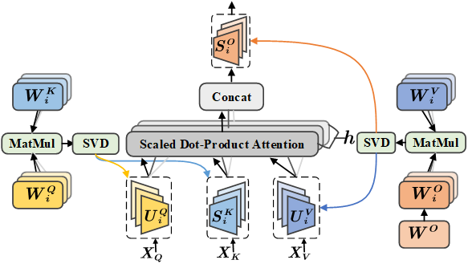
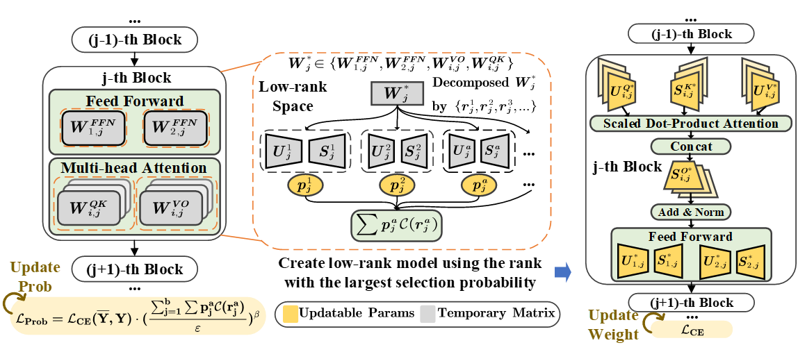
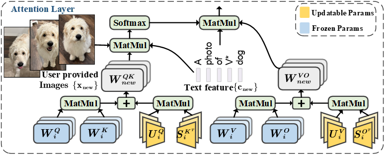

# COMCAT: Towards Efficient Compression and Customization of Attention-Based Vision Models [[arXiv]](https://) 
```bash
@inproceedings{
  comcat,
  title={COMCAT: Towards Efficient Compression and Customization of Attention-Based Vision Models },
  author={Jinqi Xiao, Miao Yin, Yu Gong, Xiao Zang, Jian Ren, Bo Yuan},
  year={2023},
  url={https://arxiv.org/pdf/},
}
```

# Performance
For compressing DeiTsmall and DeiT-base models on ImageNet, ComCAT can achieve 0.45% and 0.76% higher top-1 accuracy even with fewer parameters. ComCAT can also be applied to improve the customization efficiency of text-to-image diffusion models, with much faster training (up to 2.6× speedup) and lower extra storage cost (up to 1927.5× reduction) than the existing works.

#### Head-level low-rankness of MHA layer.
<p align="center">
    
</p>

#### Compressing vision transformer using low-rank MHA layers and automatic rank selection.
<p align="center">
    
</p>

#### Customizing text-to-image diffusion model using low-rank MHA mechanism.
<p align="center">
    
</p>
